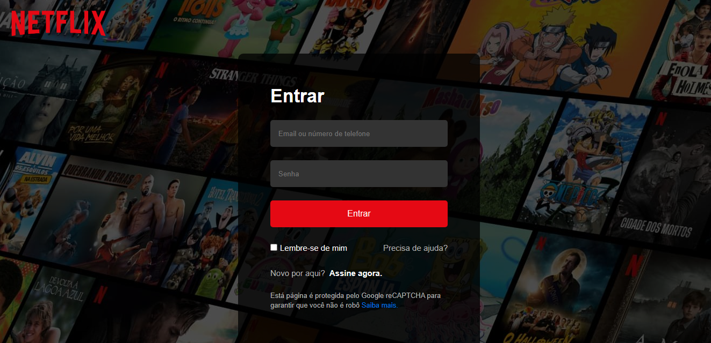

# [Acesse a Página de Login da Netflix](https://adjcds.github.io/LoginNetflix/home.html)

Este é um projeto de página de login simples inspirado na interface de login da Netflix. A página contém um formulário de login com campos de email e senha, bem como um botão de login.

## Tecnologias Utilizadas

- HTML
- CSS
  
## Passos para Executar o Projeto Localmente
Siga essas etapas para configurar e executar o projeto em sua máquina local.

1. Clone o repositório:

   Abra o terminal e execute o seguinte comando para clonar o repositório para sua máquina:

   bash
  gh repo clone Adjcds/LoginNeflix
   

2. Navegue até o diretório do projeto:

   bash
   cd LoginNeflix
   

3. Abra o Visual Studio Code e abra a pasta do projeto.

4. Execute o projeto:

   Abra o arquivo `home.html` em seu navegador da web favorito para visualizar o site localmente.

### Publicar no GitHub Pages:
Para publicar o projeto no GitHub Pages e torná-lo acessível online, siga estas etapas:

Certifique-se de que você já tenha um repositório no GitHub onde seu projeto está hospedado. Se você ainda não criou um repositório, siga as etapas para criar um no GitHub.

Certifique-se de que seu projeto tenha um arquivo index.html que serve como a página principal do seu site. O GitHub Pages usará esse arquivo como ponto de entrada para o site.

Vá para a página inicial do seu repositório no GitHub.

Clique na aba "Settings" (Configurações) no menu superior do seu repositório.

Role para baixo até encontrar a seção "GitHub Pages".

No campo "Source" (Origem), selecione a branch do seu repositório que contém o código do seu projeto. Geralmente, a branch principal é chamada de main.

Após selecionar a branch, o GitHub Pages irá automaticamente gerar um link onde seu site estará acessível online. O link será exibido na seção "GitHub Pages" assim que a configuração estiver concluída.

Aguarde alguns momentos para que o GitHub Pages construa e implante seu site.

## Agradeço por explorar o projeto! 
